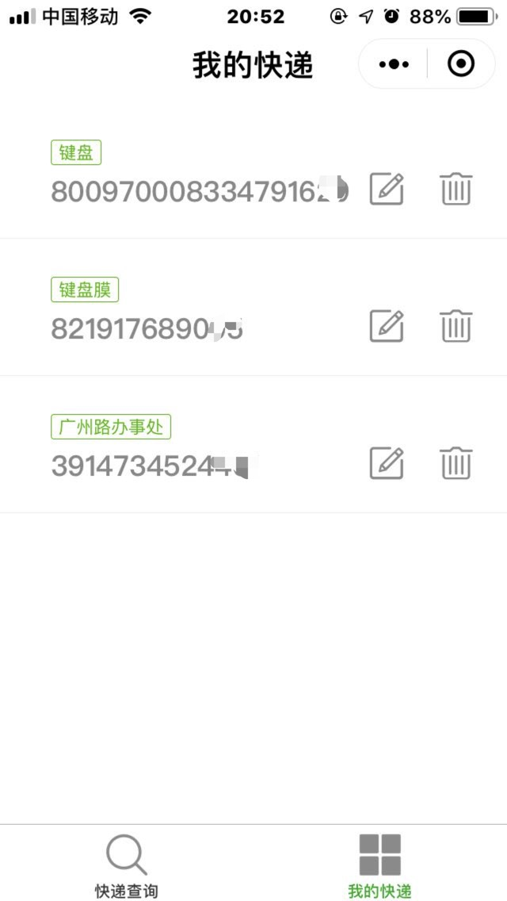

# wechat-weapp-logistics


###  微信小程序查快递

1. ui框架 [zanui](https://github.com/youzan/zanui-weapp)

2. [快递鸟接口文档](http://www.kdniao.com/api-track)

3. [base64.js](utils/base64.js)

4. [MD5.js](utils/MD5.js)

5. [GUID.js](utils/GUID.js)


> 详细请参考接口文档

```
api_url: 
	http://api.kdniao.cc/Ebusiness/EbusinessOrderHandle.aspx
```

## 小程序码


## demo


> ### **快递查询**


> ### **我的快递**




## License

[MIT license](https://github.com/RRRoger/wechat-weapp-logistics/blob/master/LICENSE).
